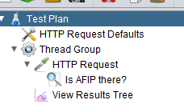
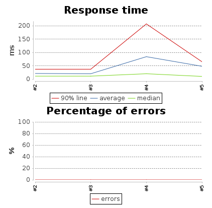

# JMeter tests
Install JMeter on your localhost  

## Create a test plan for Hello-world website
Install Jmeter on your localhost, start JMeter and create the following test plan.  

  
Start with your mouse over test plan and right click on it.  
 menu  Add -> Config Element -> HTTP Request Defaults  
Start with your mouse over test plan and right click on it.    
 menu  Add -> Thread -> Thread Group  
Start with your mouse over Thread group and right click on it.  
menu Add -> Sampler ->  Http request  
Start with your mouse over Http request and right click on it.  
menu Add -> Assertions ->  Response assertion  
Start with your mouse over Thread Group and right click on it.  
menu Add -> Listener->  View Results Tree  

Click on Response action  
In Pattern to Test  click Add and enter AFIP   
Click on HTTP Request  
In Server Name or IP: < vm_ip_address>   
Port Number : 8090  
Path: /webapp  
Click on View Results Tree   
and press the green triangle in the menu bar   

Add the JMeter global variables in the test plan screen    
Click on Add , click on the left part of the line, type IP  
in right part of a line type ${__P(IP,<our_ip>)}  
Click again on Add, click on the left part of the line, type PORT  
in right part of a line type ${__P(PORT,8090)}  


And Http_request_defaults enter respectively ${IP} and ${PORT}

 
Remove IP and port in HTTP Request  
and test again your test plan   
you must have the same result as before the changes   

Save this test plan in your github repo project, it's jmx file 


## Create a Jmeter Jenkins Job
### Add a plugin
Go to manage-Jenkins -> Manage plugins -> Tab available -> Filter Log Parser 
Check and install without restart 

go to new Item  type hello_world_jmeter 
copy from  hello_world_docker_build 
Remove all code in Build  Execute build and copy/paste
```shell script 
jmeter -Jjmeter.save.saveservice.output_format=xml -Jjmeter.save.saveservice.response_data.on_error=true -n -t jmeter_test_plan.jmx  -l testresult.jlt
```

### Add a Post-build actions    
Parserules   
Select Console ouptut (build log) parsing  
Tick Mark build Failed on Error  
Tick Use project rule  
Path to rule file in workspace :  parserules    
Apply and save

## PART OF PETCLINIC PROJECT
### Recording a test plan for Petclinic website
Install Firefox and setup the add-on named FoxyProxy  
In foxyproxy added a proxy  
Enter a title Jmeter    
Proxy Type is HTTP  
Proxy IP is localhost    
Port is 8888  
no username or password    


### Create Test plan
Start with your mouse over test plan and right click on it.    
 menu  Add -> Thread -> Thread Group  
Righ click on Test plan -> Add -> Non-test-elements -> HTTPS Test Script Recorder
  
In target controller select Test Plan ->Thread Group 
Grouping : Put each group in a new controller
Click on tab Request Filtering  
Click Add in URL Patterns to Exclude   
Copy and paste these excluded files    
```shell script
   .*\.(txt|bmp|css|js|gif|ico|jpe?g|png|swf|woff|woff2|ttf).*
```
switch firefox browser to user jmeter port  
click on start in Https test scritp recorder   
Open a tab an copy paste your petclinic URL   
```shell script
     http://<your ip address>:9090/petclinic  
```
Accept the temporary certificates created by JMeter   
Check if jmeter is recording all your actions by clicking on Thread Group   
Click on find owners, click add owner  
fill in all details   
and click add owner   
select veterinarians  
go back to find owners  
enter your name in last name and hit find owner   
Stop recording in the small jmeter windows  
Click file, select Save Test Plan As    
Save your test plan to your git repo  as petclinic_test_plan.jmx

### Set JMeter variables
As we have done for hello-world-jmeter set Test plan variable   
Add HTTP Requests Defaults variables
Remove all IP and port from other HTTP Request action
Move over Thread group -> right click -> Add -> Listener -> View Results Tree 


## Create a Jenkins Job
### Define 
Go to manage-Jenkins -> Manage plugins -> Tab available -> Filter Log Parser 
Check and install without restart   

Go New Item, Name petclinic-jmeter copy from hello-world-jmeter   
Source Management   
Git  https://github.com/<your_repo>/spring-framework-petclinic.git
Build  
Execute shell copy /paste  
```shell script 
jmeter -Jjmeter.save.saveservice.output_format=xml -Jjmeter.save.saveservice.response_data.on_error=true -n -t petclinic_test_plan.jmx  -l testresult.jlt
```
### Post-build Actions   
Select Console ouptut (build log) parsing  
Tick Mark build Failed on Error  
Tick Use project rule  
Path to rule file in workspace :  parserules   
parserules file contains a regex for checking if there is an error 


### Performance Plugin 
Go to manage-Jenkins -> Manage plugins -> Tab available -> Filter Performance  
Check and install without restart   
Go to configure petclinic-jmeter  
Go to post-build Action  
Select Publish Performance test result report    
Source data files :  testresult.jlt   
Press apply and save

  


