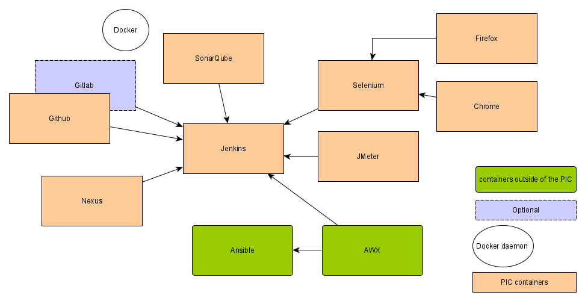

# Plateforme CI/CD de type "bac a sable".
(**Note:** Pour un environnement de production un systeme de PaaS comme Openshift ou Kubernetes est fortement conseille). 

Ce repository GitHub contient des fichiers docker-compose YAML 
qui permettent d'executer la mise en place d'une plateforme de containers
Docker qui simule un systeme de **Continuous** **Integration** et de **Delivery**. 




Cette plateforme est disponible seulement sous Linux. 

## Pre-requis pour Centos 7

```
sudo yum -y update 
sudo yum -y install git
git clone https://github.com/system-dev-formation/jenkins-pic.git
cd jenkins-pic 
sudo yum install -y git wget 
sudo yum install epel-release 
```

### Installation de la derniere version de Docker sous Centos 
L'installation de Docker necessite certains packages.
```
sudo yum install -y yum-utils \
  device-mapper-persistent-data \
  lvm2
```
Ensuite on met en place le repository Docker.
```
sudo yum-config-manager \
    --add-repo \
    https://download.docker.com/linux/centos/docker-ce.repo
```
Installer la derniere version de Docker et de ses packages client et containerd.io
```
 sudo yum install docker-ce docker-ce-cli containerd.io
```
Lancer le daemon Docker 
```
sudo systemctl start docker
```
Placer un lien symbolique pour que le daemon Docker demarre automatiquement meme si le host est reboote. 
```
sudo systemctl enable docker
```
Installation de Docker compose 
```
sudo yum install docker-compose
```

## Ou Installation de Docker avec un script Ansible 
### Packages de pre-requis pour installer Ansible 
```
sudo yum -y install python3 
```

### Set up a python virtualenv, and install ansible
```shell script
  # in the jenkins-pic directory 
  python3 -m venv venv
  source venv/bin/activate 
  pip3 install wheel  
  pip3 install ansible
```
### Lancement de la commande ansible-playbook qui va installer Docker
```
  ansible-playbook -i inventory  playbook.yml
```

### Installer docker-compose 
```shell script
  pip3 install docker-compose
```

### Install jenkins_home 
For getting all Jenkins jobs, pipelines and plugins you have to install a repository   
in the directory /opt so a sudo 
```shell script
sudo -s 
cd /opt
git clone  https://github.com/crunchy-devops/jenkins-home.git
```

## Launch all containers
Tapez la commande suivante pour installer et demarrer l'ensemble   
des containers de la plateforme de CI/CD
```
docker-compose up -d 
```


